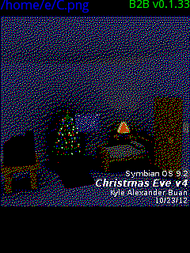

# indexed
Reduced-index color dithering and color analysis software for Alchemy OS

Indexed is an app for Alchemy OS that lets you dither images using Floyd Steinberg dithering into your own desired palette. It includes a built-in 16-color
and 32-color palette by default, but you can also create your own palettes, with common choices such as the NES and C64 palettes.

This app is an enhanced version of my previous app, Back2Basics, that became unsupported in favor to this.

It also has two bonus features:

* **Subpixel antialiasing of black-and-white** images - this takes an image, resizes it to 1/3 of its original size, and makes it so that the horizontal resolution is preserved as RGB subpixels
* **Color analysis** - will show the colors used in the image inside a 3D cube
